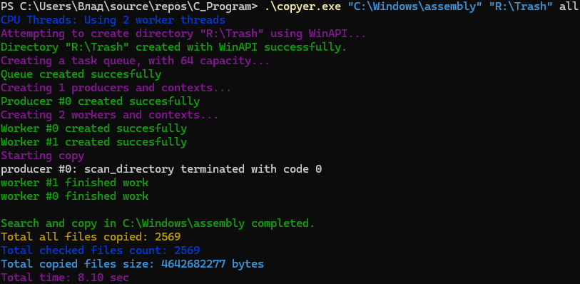
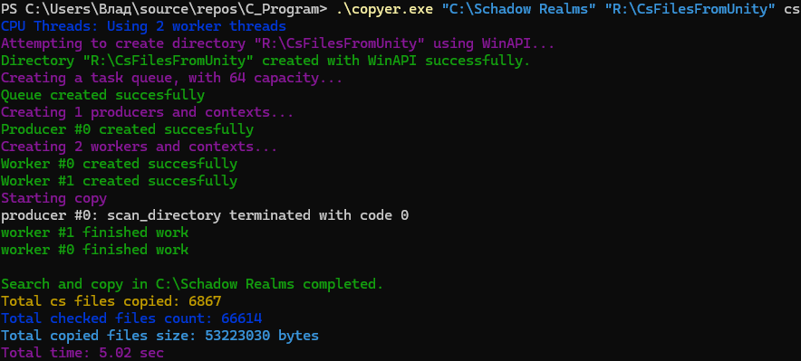
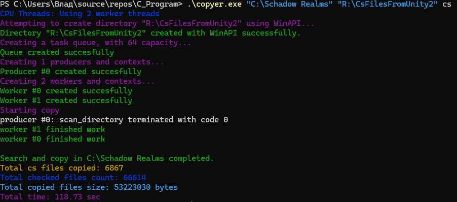

# C copyer
A cross-platform C program that copies files using a **producer-consumer (worker) model** with **pthreads**.  
It can filter files by extension and efficiently copy large numbers of files in parallel.

## Features
- Cross-platform (Linux, Windows, macOS)
- Multi-threaded using pthreads
- File filtering by extension
- Efficient producer-consumer architecture

## Performance
Tested on my laptop:
AMD Athlon Silver 3050U (2/2, 3.2GHz)
16GB RAM
Samsung 990 Pro
Ram disk for destination
Windows 11, Microsoft Defender disabled

### Test 1
```powershell
.\copyer.exe "C:\Windows\assembly" "R:\Trash" all
```


### Test 2
```powershell
.\copyer.exe "C:\Schadow Realms" "R:\CsFilesFromUnity" cs
```


### Test 3 (Microsoft Defender enabled)
```powershell
.\copyer.exe "C:\Schadow Realms" "R:\CsFilesFromUnity2" cs
```


## Usage (Windows)

### 1. Compile using MinGW
```powershell
gcc -O3 src\main.c src\core.c src\taskQueue.c -o copyerWin.exe -pthread
```

### 2. Run
```powershell
.\copyerWin.exe "C:\Windows\System32" "R:\Trash" exe
```
- "C:\Windows\System32" - folder with source files
- "R:\Trash" - the folder where the destination will be
- exe - extension filter (all - without filter)


## Usage (Linux/macOS)

### 1. Compile using GCC
```bash
gcc -O3 src/main.c src/core.c src/taskQueue.c -o copyerUnix -pthread
```

### 2. Run
```bash
root@Vlad:~/C_Copyer# ./copyerUnix /usr/include ~/ramdisk/trash all
```
- /usr/include - folder with source files
- ~/ramdisk/trash - the folder where the destination will be
- all - extension filter (all - without filter)